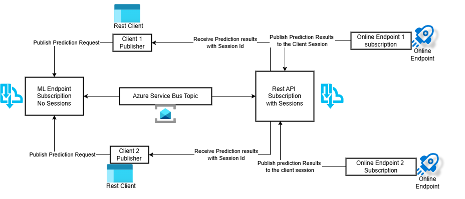
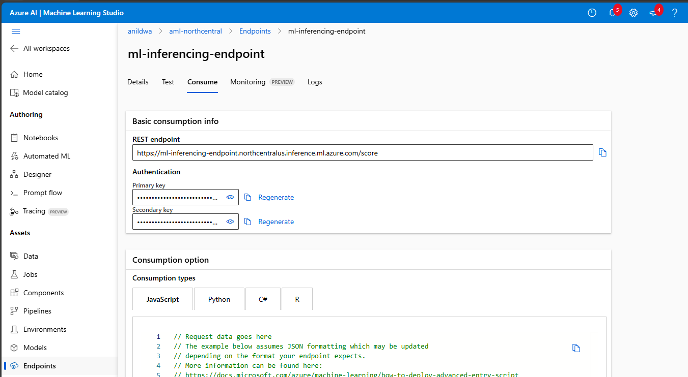

# Asynchronous Machine Learning Inferencing with Azure Service Bus and Azure Machine Learning Endpoints

## Table of Contents
1. [Overview](#overview)
2. [Azure Service Bus Concepts](#azure-service-bus-concepts)
    - [Topics](#topics)
    - [Subscriptions](#subscriptions)
    - [Sessions](#sessions)
3. [Azure Machine Learning Endpoint](#azure-machine-learning-endpoint)
4. [Machine Learning Scoring File](#machine-learning-scoring-file)
5. [End-to-End Workflow](#end-to-end-workflow)

---

## Overview

Asynchronous machine learning inferencing involves using Azure Service Bus and Azure Machine Learning endpoints to handle large-scale data processing in a non-blocking manner. This approach is beneficial for scenarios where immediate responses are not necessary, and processing can be queued and handled as resources become available.


This repository provides a step-by-step guide to setting up an asynchronous inferencing pipeline using Azure Service Bus and Azure Machine Learning endpoints. The key components include:
* Prebuilt machine learning model artifacts. The model is a telco churn prediction model.
* Azure Machine Learning workspace and environment configurations.
* Azure Machine Learning endpoints for synchronous and asynchronous inferencing.
* Prebuilt scoring file for synchronous and asynchronous inferencing. The same does both.

### Referencing Architecture




## Azure Service Bus Concepts

Azure Service Bus is a fully managed enterprise message broker with message queues and publish-subscribe topics. It ensures reliable message delivery and decouples the producers from consumers. Here are the key components involved in asynchronous processing:

### Topics

- **Definition**: A topic is used for publishing messages to multiple subscribers.
- **Use Case**: Ideal for scenarios where messages need to be sent to multiple independent receivers.
- **Example**: A message containing the URL of a blob storage file can be published to a topic, allowing multiple machine learning endpoints to subscribe and process the file independently.

### Subscriptions

- **Definition**: A subscription to a topic is a virtual queue that receives copies of messages sent to the topic.
- **Use Case**: Subscriptions enable filtering and routing of messages to specific endpoints.
- **Example**: Different subscriptions can be set up to route messages to various machine learning models based on certain criteria like message content or metadata.

### Sessions

- **Definition**: Sessions are a way to group related messages for ordered processing.
- **Use Case**: Useful for scenarios where the order of message processing is crucial, such as processing transactions in sequence.
- **Example**: A session can ensure that messages related to a particular user or process are handled in the correct order.

## Create Azure Service Bus Namespace

Please see the following this [link for detailed instructions](https://learn.microsoft.com/en-us/azure/service-bus-messaging/service-bus-quickstart-topics-subscriptions-portal) on creating an Azure Service Bus namespace.


## Create Azure Machine Learning Workspace

To set up an Azure Machine Learning Workspace, you can follow the detailed steps provided here: [Create Azure Machine Learning Workspace](https://learn.microsoft.com/en-us/azure/machine-learning/how-to-manage-workspace?view=azureml-api-2&tabs=python).

## Steps to Run Asynchronous Inferencing:

1. **Login to Azure**:
    ```bash
    az login
    ```

2. **Set the desired subscription**:
    ```bash
    az account set --subscription <subscription-id>
    az configure -l -o table
    ```

3. **Configure defaults for the workspace and resource group**:
    ```bash
    az configure --defaults workspace=aml-northcentral resource_group=aml-rg
    ```

4. **Set the workspace context**:
    ```bash
    az ml workspace set -g aml-rg -w aml-northcentral
    ```

## Registering an Azure ML Model

To register a model in Azure Machine Learning, follow these steps:

Update the name, version, and path of the model in the `model.yml` file.

```bash
az ml model create -f model.yml
```

## Creating Azure ML Environments

Update name and version of the environment in the `env_async.yml` file.

To create environments for Azure Machine Learning, follow these steps:
    
```bash
cd environment
az ml environment create -f env_async.yml
```


## Azure Machine Learning Endpoint

Azure Machine Learning endpoints are used to deploy models and handle inferencing requests. The endpoint can be configured to process incoming requests asynchronously, providing scalable and reliable inferencing capabilities.

### Key Operations

1. **Create Endpoint**:
```
cd async_inferencing
```

Update name in the `endpoint_async.yml` and run the following command:

    ```bash
    az ml online-endpoint create --file endpoint_async.yml 
    ```
2. **Create Deployment**:

Update name, model, model version and environment in the `deployment_async.yml` file.
Rename secrets.rename to secrets.env and update it with required credentials and names. 

    ```bash
    az ml online-deployment create --file deployment_async.yml 
    ```

3. **Update Deployment**:

If the scoring file or environment needs to be updated, run the following command: 

    ```bash
    az ml online-deployment update --file deployment_async.yml
    ```

4. **Update Endpoint Traffic**:

Allocate traffic to the async endpoint with 100% weight.

    ```bash
    az ml online-endpoint update --name ml-inferencing-endpoint-async --traffic "async=100"
    ```

## Machine Learning Scoring File

The scoring file is a script that defines how the model processes input data and produces output. This script is executed by the Azure Machine Learning endpoint to perform inferencing.

This provided scoring file operates in both sync and async modes. The sync mode processes the data immediately, while the async mode downloads the file from remote storage and processes the data and publishes the results to the Azure Service Bus topic.

### Example Structure

1. **Initialization**:
    - Load the model.
    - Set up any necessary resources or configurations.

    ```python
    def init():
        global model
        # Get the path to the deployed model file and load it
        model_dir =os.getenv('AZUREML_MODEL_DIR')
        model_file = os.listdir(model_dir)[0]
        model_path = os.path.join(os.getenv('AZUREML_MODEL_DIR'), model_file)
        model = mlflow.sklearn.load_model(model_path)
    ```

2. **Run Function**:
    ```python
    def run(data):
        input_data = preprocess(data)
        predictions = run_inferencing(data)
        result = postprocess(predictions)
        return result
    ```

3. **Async processing**:
    ```python
    def receive_messages():
    while True:
        servicebus_client = ServiceBusClient.from_connection_string(conn_str=CONNECTION_STR)
        session_id = ""
        with servicebus_client:
            receiver = servicebus_client.get_subscription_receiver(
                topic_name=TOPIC_NAME,
                subscription_name=ML_ENDPOINT_CLIENT_SUBSCRIPTION_NAME,
                #session_id=session_id
            )
            with receiver:
                received_msgs = receiver.receive_messages(max_message_count=10, max_wait_time=5)
                for msg in received_msgs:
                    print("Received: " + str(msg))
                    print("-------------------------")
                    #send_messages(session_id, f"Message received on {session_id}:{str(msg)}")
                    # Complete the message so that it is not received again
                    receiver.complete_message(msg)                
                    try:
                        data_dict = json.loads(str(msg))
                        session_id = data_dict['session_id']
                        blob_url = data_dict['blob_url']
                        blob_data = downloadFile(blob_url)['data']
                        print(f"Blob data downloaded.{blob_data}")
                        data=pd.DataFrame(blob_data)
                        print(f"Data loaded into pandas: {data}")
                        predictions = run_inferencing(data)
                        send_messages(session_id, f"Message received on {session_id}:{predictions}")
                        print("Message sent back to client.")
                    except:
                        print("Invalid message received.")
                        pass
    ```

## End-to-End Workflow

### Workflow Steps

1. **Upload Blob**: Upload data to Azure Blob Storage.
2. **Send Blob URL to Service Bus Topic**: Publish a message containing the blob URL to a Service Bus topic.
3. **Endpoint Receives Message**: The Machine Learning endpoint subscribes to the topic and receives the message.
4. **Download and Process Blob**: The endpoint downloads the blob, runs the model, and processes the data.
5. **Send Result to Service Bus Topic**: The result is sent to another Service Bus topic.
6. **Client Receives Result**: The client subscribes to the result topic and receives the processed data.

### Example Test Scripts

- **Synchronous Test**:

Retrieve endpoint url and key from Azure Machine Learning Studio.



Update the `endpoint_url` and `endpoint_key` in the `test-ml-endpoint-async.py` file.

- **Synchronous Test**:
    ```bash
    python .\test-ml-endpoint-async.py sync
    ```

- **Expected Result**:
    ```bash
    python .\test-ml-endpoint-async.py sync
    Environment variables loaded from secrets.env
    b'"[false]"'
    ```
- The sync operation returns the predictions immediately through the Rest API.


- **Asynchronous Test**:
    ```bash
    python .\test-ml-endpoint-async.py async
    ```
- **Expected Result**:
    ```bash
        python .\test-ml-endpoint-async.py async
    Environment variables loaded from secrets.env
    Starting to receive messages on client session-id 1476c5fb-5c53-4680-b020-447984417b27...
    Press y to send json payload: y
    File ./test-data-scoring-async.json uploaded to container mlinferencing as blob test-data-scoring-async.json
    Messages sent.

    Received on client:
    {"session_id": "1476c5fb-5c53-4680-b020-447984417b27", "blob_url": "https://anildwaadlsgen2.blob.core.windows.net/mlinferencing/test-data-scoring-async.json"}
    Press y to send json payload:
    Received on client:
    Message received on 1476c5fb-5c53-4680-b020-447984417b27:[False]
    ```
- The async operation returns the prediction asynchronously through the service bus topic.

